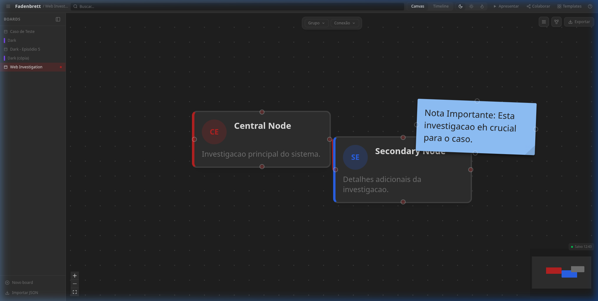
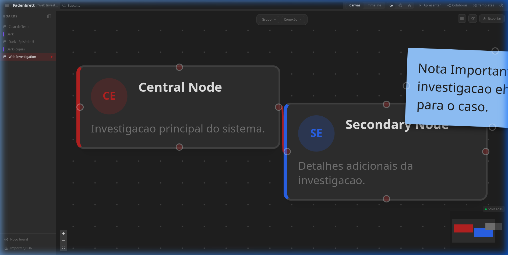
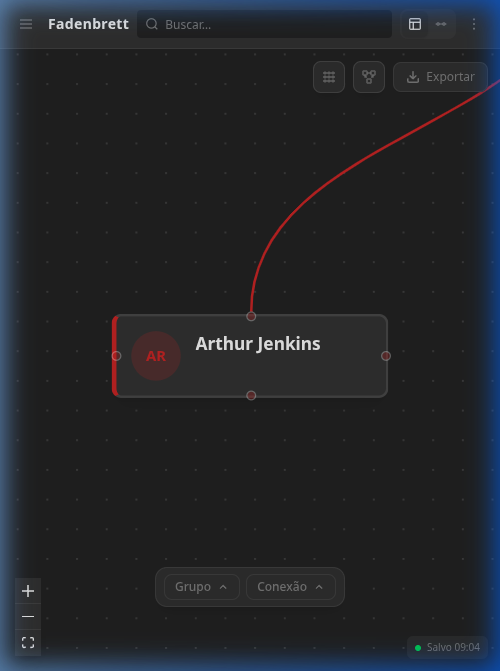
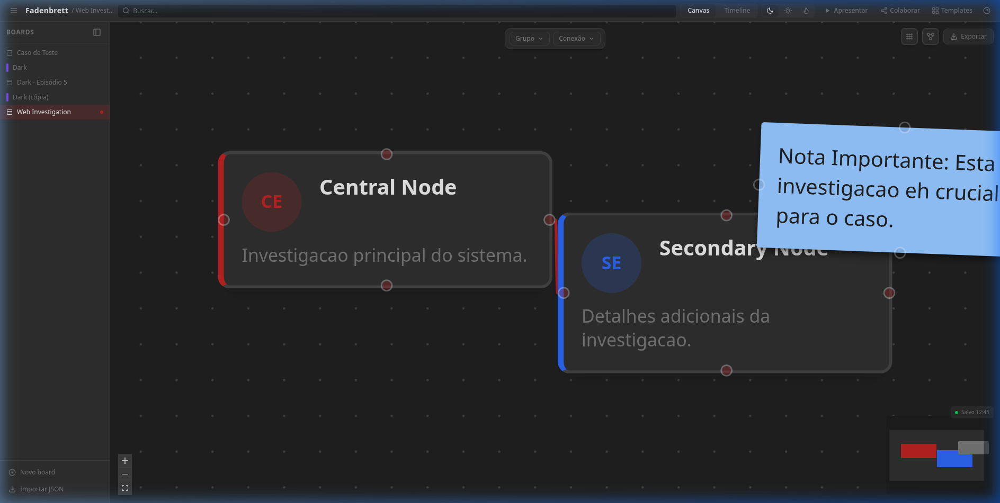
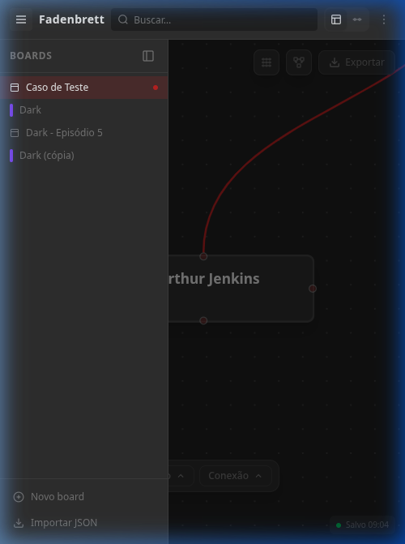

# Fadenbrett

**Siga o roter Faden. Conecte as pistas.**

Quadro de investigação digital interativo, self-hosted e open-source. Inspirado nos painéis de detetive de filmes e séries — conecte personagens, eventos e teorias com fios vermelhos num canvas infinito.

> *Fadenbrett* vem do alemão: **Faden** (fio) + **Brett** (quadro). O nome referencia o *roter Faden* (fio condutor) e os fios vermelhos dos quadros de investigação de séries como Dark.


---


*Interface Web (Desktop) — Visão geral de uma investigação no canvas infinito.*

---

## ✨ Funcionalidades Principais

Fadenbrett foi projetado para transformar caos em clareza visual, funcionando perfeitamente em dispositivos desktop e mobile.

### 🕵️‍♂️ Investigação Narrativa
- **Canvas Infinito**: Espaço ilimitado para expandir suas teorias, com movimentação fluida (pan/zoom).
- **Cards de Entidade**: Represente personagens, locais ou evidências com avatares, descrições detalhadas e metadados.
- **Conexões "Red String"**: Crie laços entre elementos usando fios vermelhos (yarn) com labels semânticos e estilos customizados.
- **Post-its Reais**: Registre hipóteses rápidas com notas adesivas que parecem papel de verdade.

### 🛠️ Organização e Precisão
- **Réguas e Snapping**: Alinhamento milimétrico com réguas virtuais e guias magnéticas para um quadro organizado.
- **Gestão de Camadas**: Controle total sobre a profundidade dos elementos (trazer para frente/enviar para trás).
- **Múltiplos Boards**: Organize diferentes investigações ou arcos narrativos em quadros independentes dentro do mesmo projeto.
- **Filtros e Dimming**: Foque no que importa com filtros por era, grupo ou tag, escurecendo o restante do canvas para manter o contexto.

### 👥 Colaboração e Apresentação
- **Real-time Collab**: Trabalhe acompanhado via WebSockets com sincronização instantânea de estado e visualização de cursores remotos.
- **Modo Apresentação**: Guie outros pela sua investigação através de um percurso estruturado de "paradas" (slides) pelo canvas.
- **Histórico Completo**: Desfaça e refaça ações com Undo/Redo ilimitado.

---

### 📱 Experiência Multi-Dispositivo
O Fadenbrett é totalmente responsivo, permitindo que você consulte ou edite sua investigação de qualquer lugar.

| Desktop | Mobile |
|---|---|
|  |  |
|  |  |

---

## 🚀 Stack Técnica

| Camada | Tecnologia |
|---|---|
| **Frontend** | React 19 + Vite + TypeScript + Tailwind v4 + Zustand + React Flow |
| **Backend** | Fastify + Drizzle ORM + SQLite (better-sqlite3) |
| **Real-time** | WebSockets (Native Fastify implementation) |
| **Infra** | Docker + Nginx + Compose + Proxmox Utility Scripts |

---

## 🔒 Privacidade e Self-hosting

Fadenbrett é **local-first** e **privacy-focused**.
- **Seus dados, sua casa**: O sistema é 100% self-hosted. Sem telemetria, sem nuvem, sem login obrigatório externamente.
- **Docker Ready**: Deploy simplificado que mantém banco de dados e arquivos locais.
- **Open Source**: Código aberto sob licença MIT.

---

## 📦 Como Instalar

### Docker (Recomendado)

```bash
git clone https://github.com/raniellimontagna/fadenbrett.git
cd fadenbrett/deploy
cp .env.example .env
docker compose up -d
```
Acesse em `http://localhost`.

### Proxmox VE (LXC)
Cole no terminal do Proxmox:
```bash
bash <(curl -fsSL https://raw.githubusercontent.com/raniellimontagna/fadenbrett/main/scripts/proxmox/install.sh)
```

---

## 🛠️ Desenvolvimento

```bash
pnpm install
pnpm dev      # Inicia web (5173) e api (3001)
pnpm test     # Roda testes de integração
```

---

## Licença

MIT — veja [LICENSE](LICENSE).

---
*Feito com ❤️ para quem gosta de conectar os pontos.*
